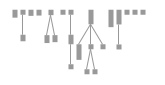

# Quelques résultats Moose sur le projet Sportstracker

## Quelques remarques

Vrai rapport : https://docs.google.com/document/d/1HVLd-DDkNB1pTyY0-ifgmar7zflIPM5q8XWdPy0OQGc/edit?usp=sharing

### Objectif

Faire une analyse du projet. 

Rendu > Une semaine après les vacances.


### Aides de code

``` console
luPackages := self.
view := RTMondrian new.
view shape rectangle
		width: [  :p | p numberOfAttributes ] ;
		height: [ :p | p numberOfMethods ] ;
		"linearFillColor: #numberOfLinesOfCode within: self entities;"
		color: [:p | p isAbstract ifTrue: [ Color red ] ifFalse: [ (p name includesSubstring:'Test') ifTrue: [ Color yellow ] ifFalse: [Color gray]] ];
		borderColor: Color lightGray.
view nodes: luPackages.
view edgesFrom: #superclass.
view treeLayout.
view open.

self select: [ :c | c superclass isNotNil and: [c superclass isStub not ] ]
```

## Résultats

### Analyse Github

#### Général

4 Contributeurs : ssaring, alexjarosch, ThomasDaheim, eliovir, ahnico

| Contributeur | Nombre d'ajouts | Nombre de suppressions | Nombre de commits |
| -----------: | :-------------- | :--------------------- | :---------------- |
| ssaring      |       ++214 388 |              --119 253 |       898 commits |
| alesjarosch  |           ++365 |                  --100 |         9 commits |
| ThomasDaheim |           ++151 |                   --92 |         7 commits |
| eliovir      |           ++496 |                  --466 |         3 commits |
| ahni         |            ++53 |                   --35 |          1 commit |

Dernier commit -> 13 octobre -> Mise à jour de version Kotlin

**Important : le projet est terminé le 24 septembre**

#### Issues

29 Issues

### Package 

``` console
self allNamespaces size
```

Result : 68

----

``` console
self allModelNamespaces size
```

Result : 24


----

``` console
luPackages := self.
view := RTMondrian new.
view shape rectangle
		width: [  :p | p numberOfClasses * 0.1 ] ;
		height: [ :p | p numberOfMethods * 0.1 ].
view nodes: luPackages.
view edgesFrom: #parentScope.
view treeLayout.
view open.
```

Result :



----

``` console
luPackages := self.
view := RTMondrian new.
view shape rectangle
		width: [  :p | p numberOfClasses * 0.1 ] ;
		height: [ :p | p numberOfMethods * 0.1 ] ;
		linearFillColor: #numberOfLinesOfCode within: self entities;
		borderColor: Color lightGray.
view nodes: luPackages.
view edgesFrom: #parentScope.
view treeLayout.
view open.
```


### Classes

``` console
self allClasses size
```

Result : 418

----

``` console
self allModelClasses size
```

Result : 198

----

``` console
(self allModelClasses asOrderedCollection sorted: [ :a :b | a numberOfMethods > b numberOfMethods ]) collect: #numberOfMethods.
```

Result :

Plus grand nombre de méthodes : 51 -> STControllerImpl
Plus petit nombre de méthodes : 1 -> 20 classes dont NameableListCell

----

**Moyenne de méthodes par classe**

``` console
(self allModelClasses collect: [ :c | c numberOfMethods ]) asOrderedCollection average asFloat.
```

Result : 7,6

----

**Médiane de méthodes par classe**

``` console
((self allModelClasses collect: [ :t | t numberOfMethods ]) asOrderedCollection sort: [ :a :b | a <b ]) median.
```

Result : 4

----

**Moyenne de lignes de code par classe**

``` console
(self allModelClasses collect: [ :c | c numberOfLinesOfCode ]) asOrderedCollection average asFloat.
```

Result : 106,5

----

**Médiane de lignes de code par classe**

``` console
((self allModelClasses collect: [ :t | t numberOfLinesOfCode ]) asOrderedCollection sort: [ :a :b | a <b ]) median.
```

Result : 51

----

**Analyse de classes**

``` console
luPackages := self.
view := RTMondrian new.
view shape rectangle
		width: [  :p | p numberOfAttributes ] ;
		height: [ :p | p numberOfMethods ] ;
		linearFillColor: #numberOfLinesOfCode within: self entities;
		borderColor: Color lightGray.
view nodes: luPackages.
view edgesFrom: #superclass.
view treeLayout.
view open.
```

Result : 


- Remarques :
    - Architecture relativement plate
    - Une architecture à 4 niveau à analyser
    - Certaines petites classes noire à analyser

**Analyse de Commentaires**

``` console
luPackages := self.
view := RTMondrian new.
view shape rectangle
		width: [  :p | p numberOfAttributes ] ;
		height: [ :p | p numberOfMethods ] ;
		linearFillColor: #numberOfComments within: self entities;
		borderColor: Color lightGray.
view nodes: luPackages.
view edgesFrom: #superclass.
view treeLayout.
view open.
```

### Autres

``` console
luPackages := self.
view := RTMondrian new.
view shape rectangle
		width: [  :p | p numberOfMethods * 0.1] ;
		height: [ :p | p numberOfLinesOfCode * 0.1] ;
		"linearFillColor: #numberOfLinesOfCode within: self entities;"
		color: [:p | p isAbstract ifTrue: [ Color red ] ifFalse: [ (p name includesSubstring:'Test') ifTrue: [ Color yellow ] ifFalse: [ (p name includesSubstring:'Main') ifTrue: [ Color blue ] ifFalse: [Color gray]]] ];
		borderColor: Color lightGray.
view nodes: luPackages.
view edgesFrom: #superclass.
view treeLayout.
view open.

self select: [ :c | c superclass isNotNil and: [c superclass isStub not ] ]

```

- Un seul main
- 821 classes non commentées
